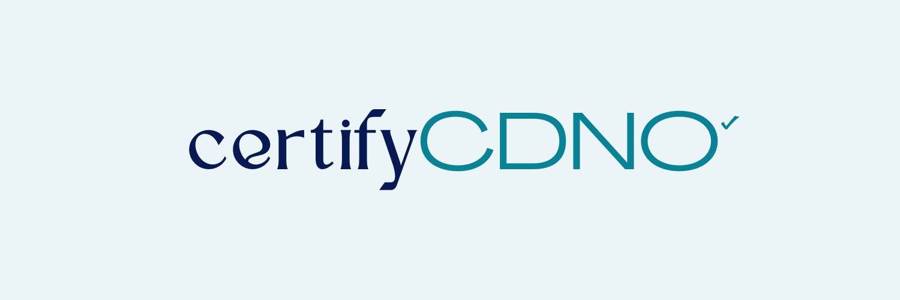

# **CertifyCDNO Prototype**



### **Overview**
CertifyCDNO is a blockchain-powered platform for decentralized certificate issuance and verification. This prototype demonstrates the core functionalities, including:
- Issuing certificates by hashing and storing data on the blockchain.
- Verifying certificates using their hash via smart contract interactions.
- Integrating governance principles for future scalability.

---

### **Features**
- **Certificate Issuance**: Securely stores certificate data as hashes on the Cardano blockchain.
- **Certificate Verification**: Allows verification of certificates directly on-chain using hashed data.
- **Wallet Integration**: Uses Nami Wallet for seamless blockchain interactions.
- **Governance Framework**: Supports multisig-based decision-making for revocations.

---

### **Requirements**
To run the project, you will need:
- Python 3.8 or later.
- Set up your dev environment to be able to use the PyCardano library with opshin for interacting with a smart contract on Cardano. Check out the [Opshin Starter Kit](https://github.com/OpShin/opshin-starter-kit) to get started.
- Nami Wallet extension installed in your browser.
- Access to the Cardano testnet through [Blockfrost](https://blockfrost.io/)
- Dependencies listed in `requirements.txt` and `package.json`

---

### **Setup Instructions**

#### **1. Clone the Repository**
```bash
git clone https://github.com/King-04/contract_test.git
```

#### **2. Setup**
- Install Python dependencies:
```bash
pip install -r requirements.txt
```
- Run the Flask server:
```bash
python app.py
```

#### **3. Testnet Access**
- Ensure your Nami Wallet is connected to the Cardano testnet.
- Obtain test ADA from a faucet like Cardano Testnet Faucet.

---

### **Usage Instructions** 

1. #### **Issuing Certificates:**
- Access the issuance page, enter certificate details, and sign the transaction with Nami Wallet.
- Copy the transaction hash for verification.

2. #### **Verifying Certificates:**
- Go to the verification page and enter the certificate hash.
- The system will interact with the blockchain to confirm validity.

---

### **Contributing**
We welcome contributions to improve the CertifyCDNO platform. Here’s how you can contribute:

1. Fork the repository.
2. Create a feature branch.
3. Commit your changes.
4. Push to branch.
5. Open a pull request.

---

### **License**
This project is licensed under the MIT License.

---

### **Contact**
For questions or feedback, feel free to contact us at [EMAIL](kboateng396@gmail.com)


